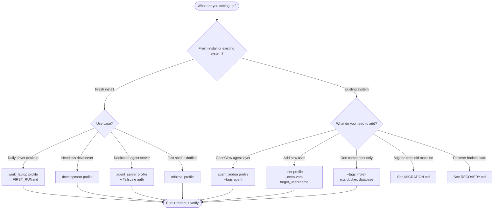

# Playbook Guide — Choosing your setup

This is the entry point for **deciding what to install** on a new or existing machine.
If you know what you want, skip to the matching recipe in the [Use-case recipes](#use-case-recipes)
section. If you don't, start with the [decision tree](#decision-tree).

For deeper details on any individual component, follow the cross-references at the bottom or
read the per-module `CLAUDE.md` files. This guide is intentionally narrative — the implementation
lives in `ansible/`.

## Decision tree



## Profile matrix

All profiles live in `ansible/profiles/` and `ansible/group_vars/all.yml`. Pick the row that matches
your use case. Roles you don't want can be skipped per-run with `--skip-tags <role>`.

| Profile | When to use | Roles included | Notes |
|---------|-------------|----------------|-------|
| `user` | Add another user to an existing system | base, dotfiles | Lightweight; assumes credentials already set up |
| `minimal` | Headless box that needs only shell + email | base, email, dotfiles | No development tools, no desktop |
| `development` | Headless dev / server / VM | base, system_files, development, database, docker, dotfiles | No desktop, no email — pure backend work |
| `desktop` | Full desktop without work-specific extras | base, system_files, development, database, docker, desktop, email, dotfiles | Sway + Wayland + dev stack |
| `full` | Everything including credentials role | All of `desktop` + credentials | Same as `desktop` plus ansible-vault credential extraction |
| `work_laptop` | Primary work machine (current ThinkPad, future Resolute Raccoon laptop) | All of `full` | Triggers NVIDIA + laptop hardware roles via auto-detection |
| `work_only` | Headless work environment without desktop | base, system_files, development, database, docker, credentials, dotfiles | Like `development` + credentials |
| `agent_server` | Dedicated headless OpenClaw agent server (separate machine) | base, credentials, docker, dotfiles, agent | UFW deny-all, Tailscale, isolated user — see [agent CLAUDE.md](ansible/roles/agent/) |
| `agent_addon` | Layer openclaw-agent onto an existing desktop (dual-use) | agent | **Skips** firewall, vault lockdown, bgo home chmod — safe on a live desktop |

### Profile composition

```mermaid
graph LR
    user[user] --> base
    user --> dotfiles

    minimal[minimal] --> base
    minimal --> email
    minimal --> dotfiles

    development[development] --> base
    development --> system_files
    development --> dev[development role]
    development --> database
    development --> docker
    development --> dotfiles

    desktop[desktop] --> development
    desktop --> deskrole[desktop role]
    desktop --> email

    full[full] --> desktop
    full --> credentials

    work_laptop[work_laptop] --> full

    work_only[work_only] --> development
    work_only --> credentials

    agent_server[agent_server] --> base
    agent_server --> credentials
    agent_server --> docker
    agent_server --> dotfiles
    agent_server --> agent

    agent_addon[agent_addon] --> agent

    style work_laptop fill:#2d4f6f
    style agent_addon fill:#2d4f6f
```



The two filled profiles (`work_laptop` and `agent_addon`) are the recommended combination
for the current dual-use setup: a full work laptop with the openclaw-agent layered on top.

## Use-case recipes

### Recipe 1 — Fresh Ubuntu 26.04 work laptop

Brand-new machine, no existing config. You want a full desktop with development tools and
the openclaw-agent layer.

```bash
# Phase 1: prerequisites (sit at the new machine or SSH in)
sudo apt update && sudo apt install -y git stow ansible python3-apt git-crypt gnupg
git clone https://github.com/bennigo/dotfiles.git ~/.dotfiles
cd ~/.dotfiles && git submodule update --init --recursive

# Transfer GPG key 0FA08B1A9096B394 from old machine, then:
gpg --import /path/to/git-crypt-key.asc
cd ~/.dotfiles/claude-private && git-crypt unlock && cd ~

# Phase 2: full work_laptop bootstrap (15-30 min)
cd ~/.dotfiles/ansible
ansible-playbook bootstrap.yml --extra-vars "profile=work_laptop" --ask-become-pass
sudo reboot

# Phase 3: agent layer
ansible-playbook bootstrap.yml \
  --extra-vars "@profiles/agent_addon.yml" --tags agent --ask-become-pass
```

Full procedure with all gotchas: [`ansible/FIRST_RUN.md`](ansible/FIRST_RUN.md).

### Recipe 2 — Headless development VM

A VM or remote box you SSH into for backend work. No GUI, no email, no agent.

```bash
sudo apt install -y git stow ansible python3-apt
git clone https://github.com/bennigo/dotfiles.git ~/.dotfiles
cd ~/.dotfiles/ansible
ansible-playbook bootstrap.yml --extra-vars "profile=development" --ask-become-pass
```

Skip the desktop role explicitly if your distro auto-detects desktop hardware:
`--skip-tags desktop,gui`.

### Recipe 3 — Add OpenClaw agent to existing work laptop

You already have a working desktop and want the isolated `openclaw-agent` user without touching
firewall, bgovault, or `/home/bgo` permissions.

```bash
cd ~/.dotfiles/ansible
ansible-playbook bootstrap.yml \
  --extra-vars "@profiles/agent_addon.yml" --tags agent --ask-become-pass
```

Verify isolation:

```bash
getent passwd openclaw-agent
sudo -l -U openclaw-agent  # should print "not allowed"
groups openclaw-agent       # should NOT include docker
sudo -u openclaw-agent ls /home/bgo  # should print "Permission denied"
```

Then onboard OpenClaw manually (the playbook stops short of interactive setup):

```bash
sudo -u openclaw-agent -i
export PATH=$HOME/.local/share/fnm:$PATH && eval "$(fnm env)"
source /opt/openclaw/config/agent.env
openclaw onboard --install-daemon
```

### Recipe 4 — Migrate from old machine to new

> **Status:** Detailed procedure pending in `MIGRATION.md` (Phase 4 of the docs overhaul).
> Until then, the high-level steps are:

1. On old machine: `gpg --export-secret-keys --armor 0FA08B1A9096B394 > /tmp/key.asc`
2. Transfer `/tmp/key.asc`, `~/.password-store/`, and `~/.ssh/` to new machine via USB or rsync
3. On new machine: follow Recipe 1 (fresh install)
4. Verify both machines see the same `pass` entries before retiring the old one

### Recipe 5 — Just install one component

You don't want a full bootstrap, you just need (e.g.) Docker on an existing system.

```bash
cd ~/.dotfiles/ansible
ansible-playbook bootstrap.yml --tags docker --ask-become-pass
```

Available tags (run `--list-tags` to see all): `base`, `system`, `development`, `database`,
`docker`, `desktop`, `credentials`, `dotfiles`, `email`, `agent`, `hardware`, `nvidia`, `laptop`.

You can stack tags: `--tags "docker,database"` runs both roles in sequence.

### Recipe 6 — Recover from broken state

> **Status:** Unified recovery procedures pending in `RECOVERY.md` (Phase 4 of the docs overhaul).
> For now:
>
> - **Stow conflict on `.zshenv`:** `stow -R --ignore='\.zshenv' zsh` (known workaround, see CLAUDE.md memory)
> - **Failed credential extraction:** verify `system/scripts/ansible-vault-pass.sh` returns the right password, then re-run with `--tags credentials`
> - **Lost GPG key:** see [`system/emergency-recovery.md`](system/emergency-recovery.md)
> - **Bootstrap halted mid-run:** Ansible is idempotent — re-run the same command, it will skip completed tasks

## Hardware overrides

The playbook auto-detects hardware via `gather_facts`, but you can force values:

```bash
# Force NVIDIA driver version (e.g., on Ubuntu 26.04 if 580 isn't packaged yet)
ansible-playbook bootstrap.yml --extra-vars "profile=work_laptop nvidia_driver_version=590"

# Force laptop power management even on a desktop
ansible-playbook bootstrap.yml --extra-vars "profile=full force_laptop=true"

# Skip all hardware-specific roles
ansible-playbook bootstrap.yml --extra-vars "profile=desktop skip_hardware_specific=true"
```

Hardware variables live in `ansible/group_vars/all.yml` under `hardware_roles:`.

## Cross-references

| Topic | Where to look |
|-------|---------------|
| Fresh-install procedure with prerequisites | [`ansible/FIRST_RUN.md`](ansible/FIRST_RUN.md) |
| Detailed installation walkthrough | [`ansible/INSTALL.md`](ansible/INSTALL.md) |
| Per-role reference and tags | [`ansible/CLAUDE.md`](ansible/CLAUDE.md) |
| Database setup and credentials | [`ansible/DATABASE_SETUP.md`](ansible/DATABASE_SETUP.md) |
| Stow deployment order and conflicts | [`STOW_ORDER.md`](STOW_ORDER.md) |
| Multi-machine sync workflow | [`SYNC_WORKFLOW.md`](SYNC_WORKFLOW.md) |
| Credential management (GPG / pass / vault) | [`system/credentials.md`](system/credentials.md) |
| Emergency credential recovery | [`system/emergency-recovery.md`](system/emergency-recovery.md) |
| Per-module configuration details | Each `<module>/CLAUDE.md` |
| Top-level routing for AI agents | [`CLAUDE.md`](CLAUDE.md) |

---

*Last reviewed: 2026-04-11*
